<div align="center">


# pocketwatch

**Time tracking for freelancers and the self-employed.
One click to start, one PDF to invoice — and every byte stays on your own machine.**


</div>

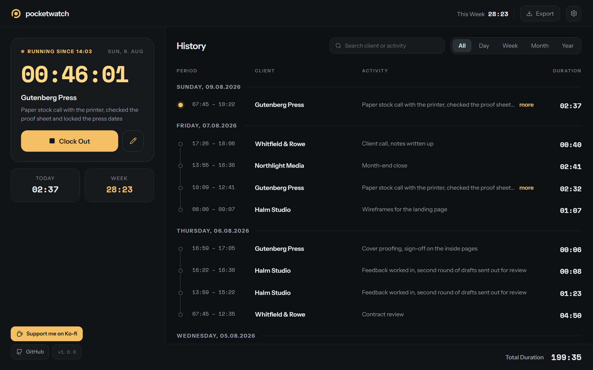

---

## 🚀 Try it in 30 seconds

**Download [`Pocketwatch-standalone.html`](Pocketwatch-standalone.html) and double-click it.**
([direct link to the file](https://raw.githubusercontent.com/winnicodes/pocketwatch/main/Pocketwatch-standalone.html))

One single HTML file: the whole app with demo data, no server, no Docker, no internet.
Start, stop, search, filter, edit, export PDF and CSV — all of it real. The demo saves
nothing; a reload puts it back to where it started.

The file is not a mockup, it is a build of the app:

```bash
cd webapp && npm ci && npm run standalone   # writes ../Pocketwatch-standalone.html
```

---

## 💡 Why pocketwatch?

|  | |
|---|---|
| 🔒 **Your data stays yours** | Two JSON files on your own disk. No account, no subscription, no tracking, not a single request leaving the machine — even the fonts ship inside the container. |
| ⚡ **As fast as a pocket calculator** | No spinner, no database. Start and stop are one click, the timer keeps counting to the second and survives a reload. |
| 🧾 **Ready to invoice** | A PDF report with your name on it, or CSV for your spreadsheet and bookkeeping — either the filtered view or a date range you pick. |
| 📱 **Works in either hand** | The same app on a 27-inch monitor and on a phone: two columns here, cards and a drawer there. |
| 🐳 **One container, done** | `docker compose up -d --build`. Runs on a NAS, a Raspberry Pi or your laptop. |

---

## 🎬 The app, feature by feature

### ⏱️ Track — client, activity, go

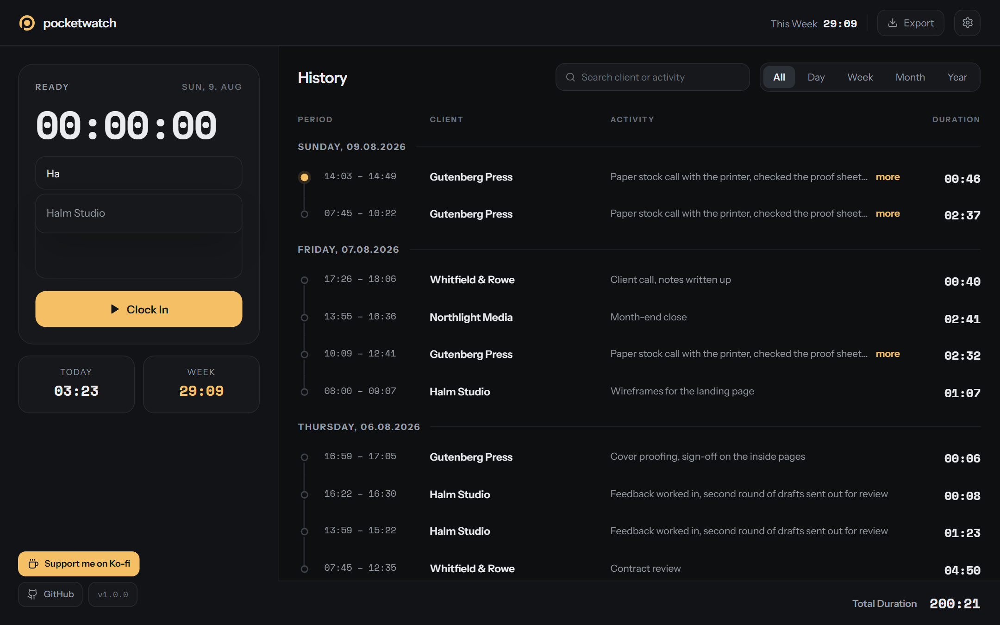

- **Client autocomplete** — most recently used clients first, pick with the arrow keys
- **Clock In** starts immediately; the activity text can still be typed **while the timer runs**
- **Live timer to the second**, with **Today** and **Week** totals right below it
- Forgot the client name? The entry lands under “No client” — nothing gets lost
- Timer running for more than 8 hours → **“forgot to clock out?” hint** (can be turned off)

### 📜 History — grouped by day, totalled at the bottom

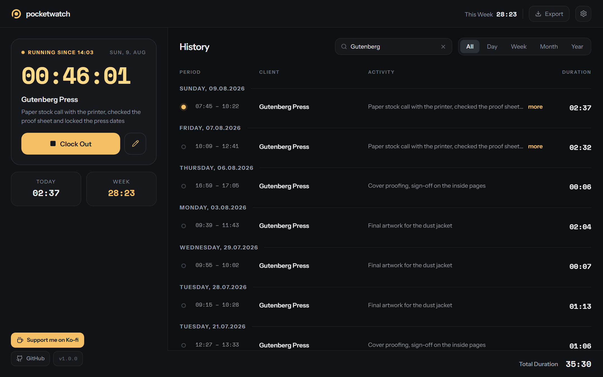

- **Grouped by day** with a date heading, **total duration of the current selection** always visible in the footer
- **Full-text search** across client *and* activity, filtering as you type
- Day headings stick to the top while you scroll (can be turned off)
- Long activity texts are clipped and expand on **“more”**
- Large histories load in chunks — the totals still count every match, not just the visible rows

### 🗓️ Period — day, week, month, year, and step back through time

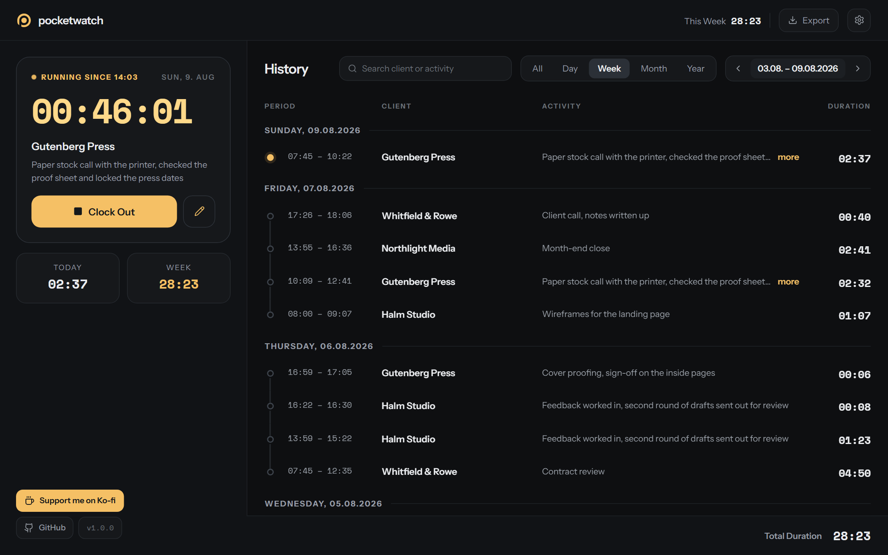

Click **Day / Week / Month / Year**, then step backwards with the arrows — the total is
recalculated for every period. “All” brings back the complete history.

### ✏️ Edit — fix it, or add what you forgot

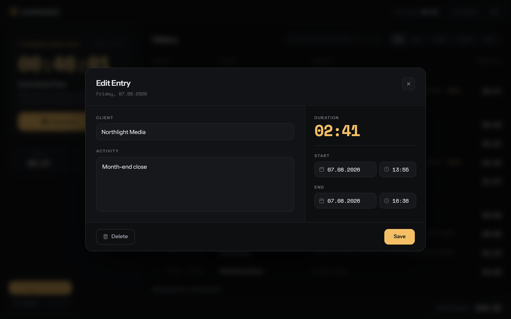

- Client, activity, **start and end by date and time** — the **duration updates live**
- Custom date and time pickers instead of browser chrome: same design, fully keyboard-operable
- Invalid times are rejected (end before start, a half-filled end)
- **Deleting always asks first** — and unsaved changes ask before the dialog closes

### 📤 Export — PDF for the client, CSV for the office

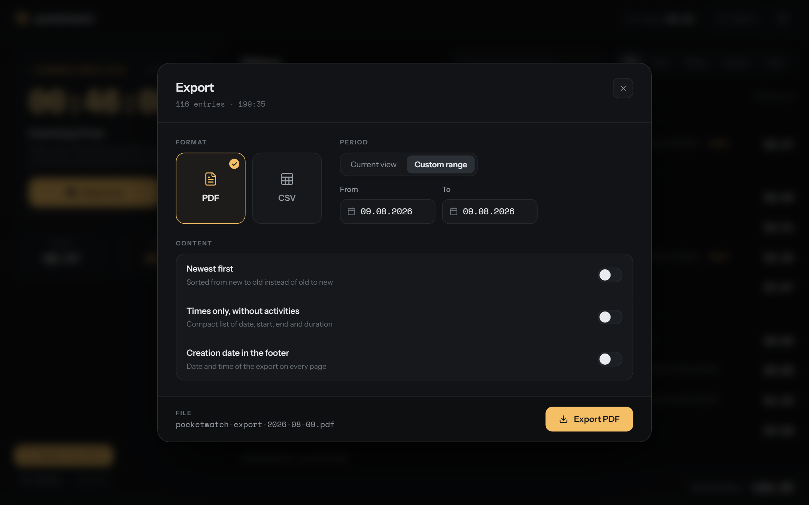

- **PDF**: formatted report with your name, page numbers, optionally the export date in the footer
- **CSV**: semicolon-separated with a BOM — Excel opens it without mangling accented characters
- **Current view** (inherits search and period filter) or a **custom date range**
- **Newest first** and **times only, no activities** for the compact list
- The dialog tells you up front how many entries and how many hours will end up in the file

### ⚙️ Settings — including rounding

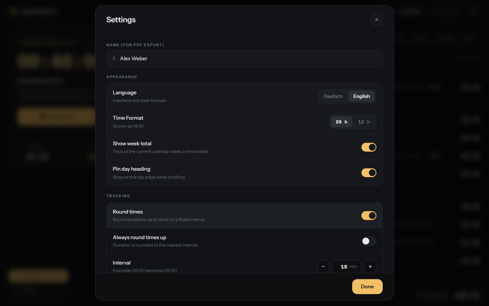

- **Name** for the header of the PDF export
- **German / English** and **12h / 24h** — date formats follow along
- **Week total** in the header and **sticky day headings** on or off
- **Round times** to a fixed interval (1–60 min), optionally always upwards — with a live
  example (“00:37 becomes 00:30”). Rounding applies everywhere: history, totals, PDF, CSV.
- **Reminder** for timers left running

---

## 📱 Responsive — same app, different hand

Below 1024 px the two-column layout becomes one view at a time, switched through the
drawer. Search, filter and export move into the header, table rows turn into cards and
dialogs into full-screen views — no shrunk-down desktop, no pinch-zooming, no second app.

<table>
<tr>
<td width="25%">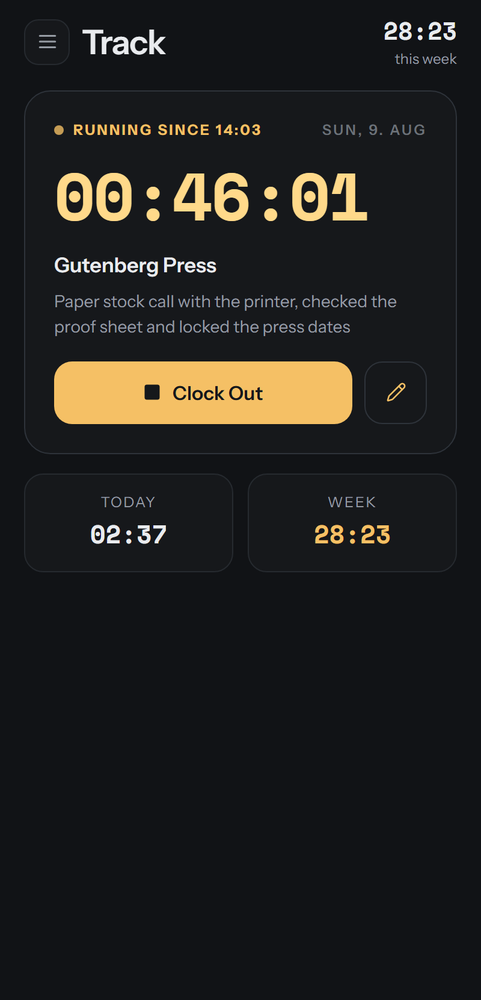<br><sub><b>Track</b> — running timer</sub></td>
<td width="25%">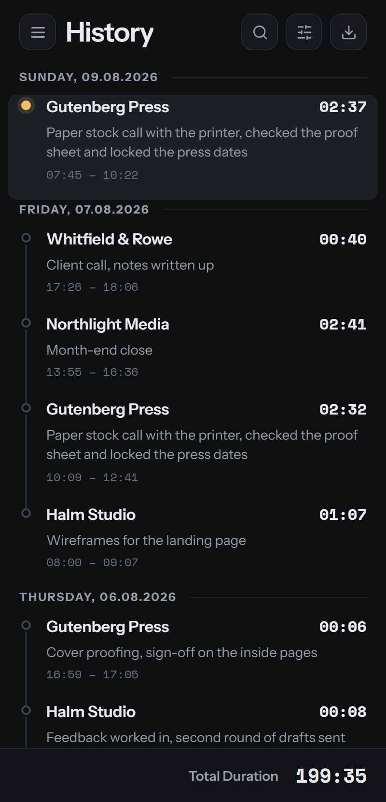<br><sub><b>History</b> — cards, not a table</sub></td>
<td width="25%">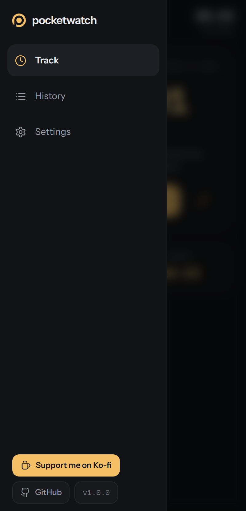<br><sub><b>Drawer</b> — switch sections</sub></td>
<td width="25%">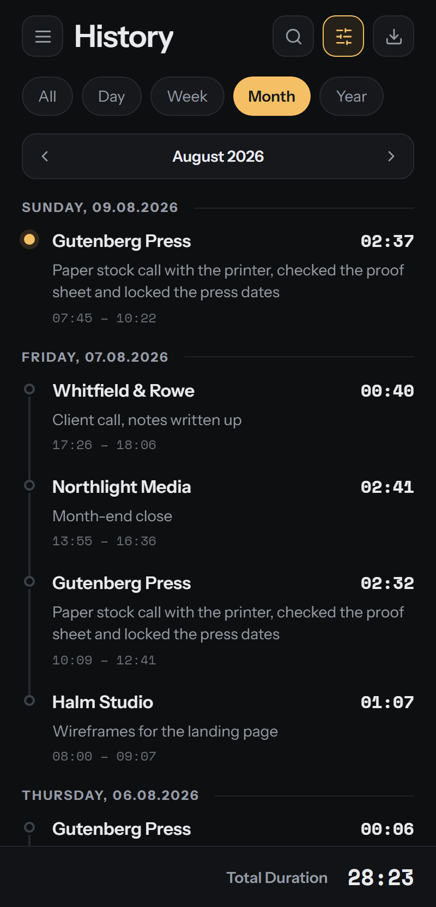<br><sub><b>Filter</b> — period as pills</sub></td>
</tr>
<tr>
<td>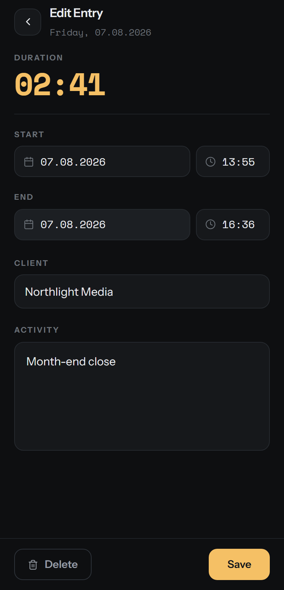<br><sub><b>Edit</b> — full screen</sub></td>
<td>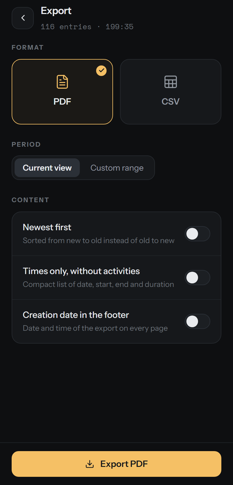<br><sub><b>Export</b> — same options</sub></td>
<td>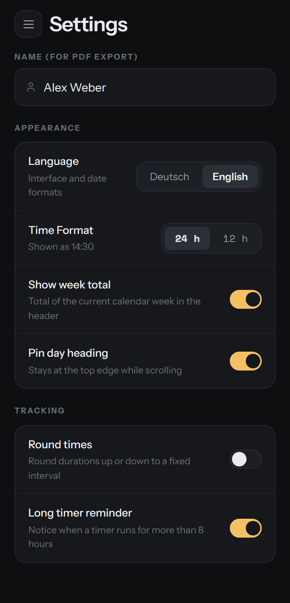<br><sub><b>Settings</b> — all of them</sub></td>
<td valign="middle"><sub>Manifest, icons and theme colour are included: “Add to Home Screen” gives pocketwatch its own icon that opens without a browser bar.</sub></td>
</tr>
</table>

---

## ✨ Every feature at a glance

**Tracking**
- One-click start/stop, live timer accurate to the second
- A running entry survives a reload or a device switch (it lives in `times.json`)
- Client autocomplete, activity editable at any time
- Totals for today and the current week
- Warning for timers running longer than 8 hours

**History**
- Grouped by day, total duration of the filtered selection in the footer
- Full-text search across client and activity
- Period filter day/week/month/year/all with stepping backwards and forwards
- Sticky day headings, expandable activity texts, chunked loading

**Editing**
- Client, activity, start and end (date + time), duration calculated live
- Custom date/time pickers, fully keyboard-operable
- Validation of impossible times, confirmation before deleting or discarding

**Export**
- PDF report (name, page numbers, optional export date)
- CSV for Excel and bookkeeping (semicolon + BOM)
- Current view or custom date range, sort direction, “times only” variant

**Settings**
- German/English, 12h/24h
- Rounding to 1–60 min, to the nearest interval or always upwards
- Week total, sticky day headings, long-run reminder
- Name for the PDF export

**Under the hood**
- Storage in `data/times.json` and `data/config.json`, written atomically
- Writes are debounced; nothing is lost when the tab is closed
- Docker container (Nginx + PHP-FPM on Alpine)
- Self-hosted fonts, no CDN, no telemetry
- Keyboard-operable, ARIA roles for switches, listboxes and dialogs

---

## 🐳 Install with Docker (recommended, Windows + Linux)

The container builds the frontend itself — you do **not** need Node on the host.

```bash
git clone https://github.com/winnicodes/pocketwatch.git
cd pocketwatch
docker compose up -d --build
```

Open <http://localhost:8080>

Your time entries then live in the `data/` folder next to `docker-compose.yaml`.

### Without docker-compose

Linux / macOS:

```bash
docker build -t pocketwatch-app .
docker run -d -p 8080:80 -v "$(pwd)/data:/var/www/html/data" --name pocketwatch pocketwatch-app
```

Windows (PowerShell):

```powershell
docker build -t pocketwatch-app .
docker run -d -p 8080:80 -v "${PWD}/data:/var/www/html/data" --name pocketwatch pocketwatch-app
```

> Docker does not accept relative paths like `./data` for `-v` — hence `$(pwd)` / `${PWD}`.

The container fixes the permissions on `data/` at startup, so a folder created by root is
not a problem.

### PowerShell helpers

Small wrappers for Windows are included: `_docker-build.ps1`, `_docker-run.ps1`,
`_docker-stop.ps1`, `_docker-restart.ps1`, `_docker-logs.ps1`, `_docker-cleanup.ps1`.

---

## 🛡️ Security & privacy

pocketwatch collects nothing, sends nothing and loads nothing. No analytics, no fonts from
Google, no external API — the container only ever talks to itself.

> **Important:** the API deliberately has **no authentication** — pocketwatch is meant to
> run on your own LAN. Do not expose the container to the open internet: whoever reaches
> the URL can read and change every time entry. If you need access from outside, put a
> reverse proxy with authentication or a VPN in front of it.

---

## 💾 Data persistence

Everything lives in the mounted `data/` folder:

- `data/times.json` — all time entries
- `data/config.json` — settings (name, language, time format, rounding …)

Writes go to a temporary file and are then renamed into place: an interrupted write cannot
destroy a good file. As long as the folder is mounted on the host, your data survives every
update and every container rebuild. `_docker-cleanup.ps1` deliberately leaves `data/` alone.

For a backup, copying the `data/` folder is enough.

---

## 📁 Project layout

```
pocketwatch/
├── webapp/                 # React frontend (Vite)
│   ├── src/
│   ├── public/
│   │   ├── api/            # PHP API (read.php / write.php)
│   │   ├── fonts/          # Instrument Sans / Space Mono (self-hosted)
│   │   └── locales/        # de.json / en.json
│   ├── scripts/            # demo-data.mjs, standalone.mjs
│   ├── dist/               # build output (not in Git)
│   └── package.json
│
├── data/                   # persistent data (not in Git)
│   ├── times.json          # time entries
│   └── config.json         # settings
│
├── docs/                   # screenshots for this README
├── Pocketwatch-standalone.html   # single-file demo (npm run standalone)
├── Dockerfile              # production container (Nginx + PHP + dist)
├── nginx.conf              # Nginx configuration
├── docker-compose.yaml     # the recommended way to start
└── README.md
```

---

## 🛠️ Local development

Requires Node.js 20+.

```bash
cd webapp
npm ci
npm run dev
```

Vite serves <http://localhost:5173> with hot reload. No container needed: Vite cannot run
PHP, but `vite.config.ts` reimplements `api/read.php` and `api/write.php` for development
and works on the same `data/` folder as the container. PHP remains authoritative in
production.

More scripts:

```bash
npm test         # tests for the time validation (node:test, no extra dependencies)
npm run build    # typecheck (tsc) + production build into webapp/dist
npm run demo-data -- --running   # demo data into data/ (--force overwrites, --en for English)
npm run standalone               # single-file demo (see above)
```

---

## 🔁 Updates

```bash
git pull
docker compose up -d --build
```

---

## 🚀 Tech stack

React 19 · TypeScript · Tailwind CSS 4 · Vite 7 · date-fns · react-day-picker ·
jsPDF + jsPDF-AutoTable · PHP 8.4 (FPM) · Nginx · Alpine Linux

---

## ❤️ Support

Please file issues and feature requests through GitHub Issues.

If pocketwatch saves you time, you can buy me a coffee:
**[ko-fi.com/winnicodes](https://ko-fi.com/winnicodes)** — the same link sits at the bottom
left inside the app.

---

## 📜 License

MIT — see [LICENSE](LICENSE). Take it, use it, change it.
